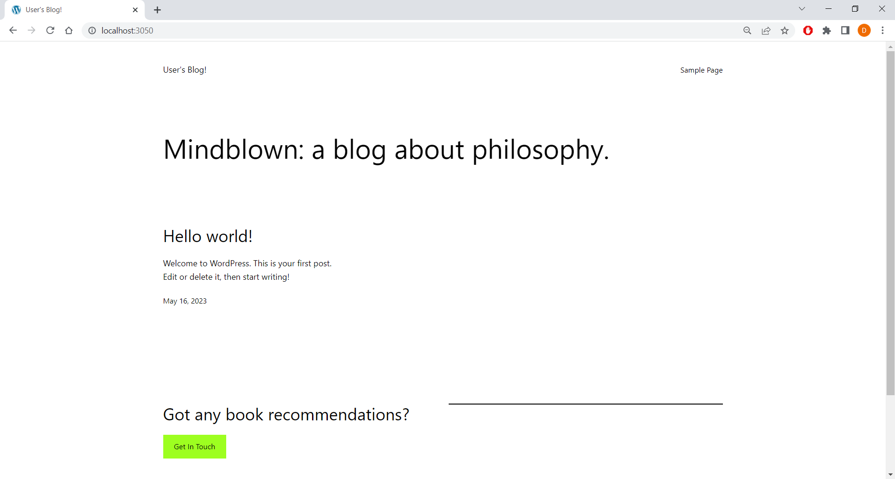

### Final-Project-Assessment-for-Scalefocus-Academy

Deploy a WordPress on Kubernetes (using Minicube) with Helm and automation with Jenkins.

---

### Prerequisites:
1. Install the necessary tools: Minicube, Helm and Jenkins.
- Minikube: https://minikube.sigs.k8s.io/docs/start/
- Helm: https://github.com/helm/helm/releases
- Jenkins: https://www.jenkins.io/doc/book/installing/windows/

2. Separate repo in your GitHub Profile named: Final Project Assessment for Scalefocus Academy.
- Press on the + sign in the top right corner -> New Repository -> name it Final Project Assessment for Scalefocus Academy.

### Requirement for the Project Assessment:
1. Download Helm chart for WordPress. (Bitnami chart:https://github.com/bitnami/charts/tree/main/bitnami/wordpress)
- I downloaded and installed it locally:

2. In values.yaml, you need to change line 543 from type: LoadBalancer to type: ClusterIP:
- Then, open up and edit the values.yaml file line 534 from LoadBalancer to ClusterIP:

- After changing the value, I had to upgrade the file with the following command so the changes can take effect:

- To install the chart, I used the following command:

- And verify that it's of type ClusterIP:

- Port-forward it so we can login locally:

- Check the sample login page:

3. Create a Jenkins pipeline that checks if wp namespace exists, if it doesn’t then it creates one.
   Checks if WordPress exists, if it doesn’t then it installs the chart.
- Dashboard -> New Item -> Enter a Pipeline’s name and select Pipeline. Press on Configure on the left side and scroll down to Pipeline. After a lot of troubleshooting and modifying, this is the final script that checks if wp namespace exists, if it doesn’t then it creates one:
```groovy
 pipeline {
    agent any

    environment {
        KUBECONFIG = 'C:\\ProgramData\\Jenkins\\.jenkins\\kubeconfig.yaml'
    }

    stages {
        stage('Check Namespace') {
            steps {
                script {
                    // Run kubectl command to check if namespace exists
                    def namespace = 'wp'
                    def namespaceExists = bat(returnStdout: true, script: "kubectl get namespace ${namespace} --kubeconfig=\"%KUBECONFIG%\" 2^>nul | find /c \"${namespace}\"").trim()

                    // Check the output to determine if the namespace exists
                    if (namespaceExists == '1') {
                        echo "Namespace '${namespace}' already exists."
                    } else {
                        echo "Namespace '${namespace}' does not exist."
                    }
                }
            }
        }
    }
}
```
- Successful build:

- The console output:


- To check if WordPress exists, if it doesn’t then it installs the chart, this is the script I used:
```groovy
 pipeline {
    agent any

    stages {
        stage('Check WordPress') {
            steps {
                script {
                    def wordpressExists
                    try {
                        wordpressExists = bat(
                            script: 'kubectl get deployment final-project-wp-scalefocus --kubeconfig="C:\\ProgramData\\Jenkins\\.jenkins\\kubeconfig.yaml" --namespace wp 2>nul | find /c "final-project-wp-scalefocus"',
                            returnStdout: true
                        ).trim().toInteger()
                    } catch (Exception e) {
                        wordpressExists = 0
                    }

                    if (wordpressExists == 0) {
                        echo "WordPress deployment 'final-project-wp-scalefocus' does not exist. Installing the chart..."
                        bat 'helm install final-project-wp-scalefocus bitnami/wordpress --kubeconfig="C:\\ProgramData\\Jenkins\\.jenkins\\kubeconfig.yaml" --namespace wp'
                        echo "WordPress deployment 'final-project-wp-scalefocus' installed."
                    } else {
                        echo "WordPress deployment 'final-project-wp-scalefocus' already exists."
                    }
                }
            }
        }
    }
}
```
- Which actually failed with an error message pointing that "'helm' is not recognized as an internal or external command, operable program or batch file." Which I was currently unable to fix - the helm path is added in the Environment Variables -> System variables section, everything restarted, still no success. It shows the version however:


4. Name the Helm Deployment as: final-project-wp-scalefocus.
- This is the script I used here:
```groovy
 pipeline {
    agent any

        stage('Helm Deployment') {
            steps {
                script {
                    bat 'helm upgrade final-project-wp-scalefocus bitnami/wordpress --kubeconfig="C:\\ProgramData\\Jenkins\\.jenkins\\kubeconfig.yaml" --namespace wp'
                    echo "WordPress deployment 'final-project-wp-scalefocus' upgraded."
                }
            }
        }
    }
}
```
5. Deploy the helm chart using the Jenkins pipeline.
- For this step, I decided to try with a Jenkins file, which is still available in the repository. With the current script inside, the builds are always successful, but the deployment does not work as per the requirements.
- Dashboard -> Select the Pipeline -> Configure -> Scroll down to Pipeline -> Select Pipeline script from SCM input the information:


- The build process:


- The console output:


6. Load the home page of the WordPress to see the final result.
- The final result would be similar to the sample login page from above.
